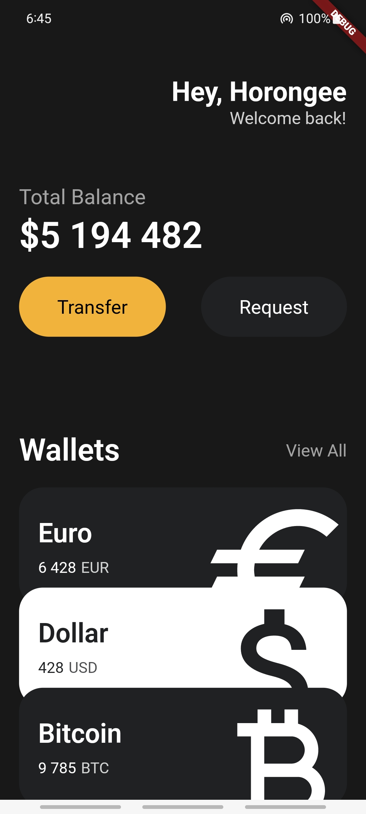
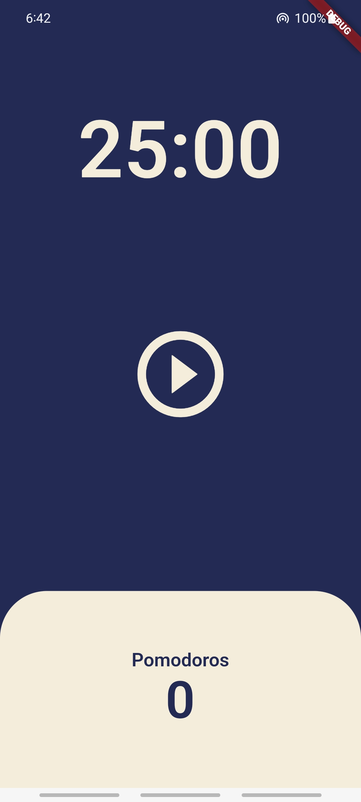
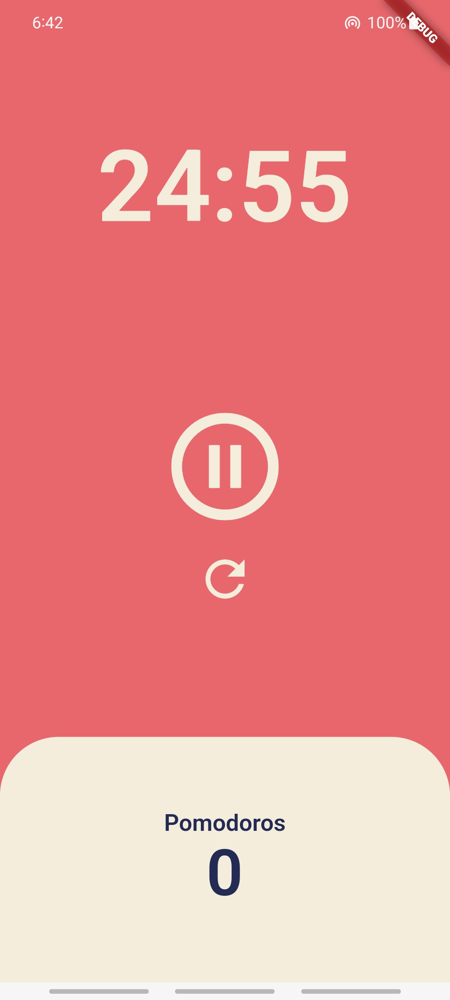

# Practice Flutter

## History
- [**toonflix**](https://github.com/chopinoff/practice-flutter#toonflix) 진행중 (2023.06.23~)
 

## How To Use
### 1. Flutter 설치 및 기본 환경 설정
- Flutter 설치 및 설정 가이드는 [**여기로**](https://github.com/chopinoff/today-i-learned/blob/master/FrontEnd/Flutter/00_Flutter_Intro.md#installation-for-windows)
### 2. 레포지토리 복사
- `git clone https://github.com/chopinoff/practice-flutter.git`
### 3. 프로젝트에 해당하는 브랜치로 이동 후 패키지 다운로드
- Project Summary의 각 프로젝트 이름이 브랜치 이름 
- 브랜치 이동 : `git switch 브랜치 이름`
- 패키지 다운로드 : `pubspec.yaml` 파일에서 다운로드 클릭
### 4. 원하는 커밋 시점으로 이동
- Project Summary의 **각 소단원의 마지막 커밋 해시코드**를 사용하면 원하는 커밋으로 빠르게 이동할 수 있음
- 이전 커밋 내역 확인하기 : `git log` 입력 후 아래 방향키 (종료는 q)
- 원하는 커밋의 해시코드 복사 후 해당 커밋 시점으로 이동 : `git checkout 복사한 해시코드`
- 이동 직전 커밋으로 돌아가기 : `git checkout -`
- 가장 최신 커밋으로 돌아가기 : `git checkout 브랜치 이름`
 

## Project Summary
### toonflix
Nomad Coders(노마드 코더) [**플러터로 웹툰 앱 만들기**](https://nomadcoders.co/flutter-for-beginners) 강의를 바탕으로 만든 프로젝트

<b>1. Wallet App (UI Challenge) : <code>d9b243249c831d5b995ed8216d4f97425bbd88e4</code></b>

- Start Flutter
- Header
- Buttons Section
- VSCode Settings
- Reusable Widgets
- Cards
- Icons and Transforms
- Reusable Cards
- Code Challenge
- Wallet App Fin.
- Wallet App Screen 분리 : `d9b243249c831d5b995ed8216d4f97425bbd88e4`

 

<b>2. Pomodoro App : <code>93398b49199343a4dc8832e5f8c7ca6fdadeea84</code></b>

- State
- setState
- setState Recap
- Theme, BuildContext
- Widget Lifecycle
- User Interface
- Timer
- Pause Play
- Date Format
- Code Challenge
- Pomodoro App Fin.
- Pomodoro App ThemeData 분리
- StatusBar 색상 변경 : `93398b49199343a4dc8832e5f8c7ca6fdadeea84`

